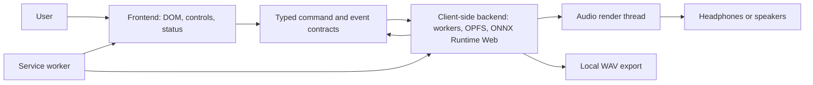

# Agent Orientation

Read this note before changing code. The wiki is the source of truth. Start from [[Implementation TODOs]] for current package status, then use its exact `rg` marker query to find low-level seams. Archived notes preserve history but are not implementation instructions. Read [[Experience Principles]] before designing either UI or backend behavior. The product is a privacy-first PWA whose apparent “backend” runs inside the same browser as its frontend. No production audio service exists on the home server.

## Five-minute model

The frontend never owns full PCM, model tensors, or durable chunk writes. The client-side backend never edits the DOM. The audio render thread never waits for storage, network, inference, or the main thread. The service worker owns versioned executable assets, not project audio.

## Read by task

| Task | Read first | Then |
| --- | --- | --- |
| UI, workflow, accessibility | [[Experience Principles]] | [[Frontend Architecture]], [[User Experience and Recovery]], [[Requirements]] |
| Workers, storage, inference | [[Client-Side Backend Architecture]] | [[Memory and Storage]], [[Model Runtime and Licensing]], [[Boundary Contracts]] |
| Playback and mixing | [[Client-Side Backend Architecture]] | [[Transport and Automation]], [[Mixer and Controls]] |
| Import/resampling | [[Boundary Contracts]] | [[Ingestion and Timeline]], [[Memory and Storage]] |
| Export/metering | [[Boundary Contracts]] | [[Export and Metering]], [[Validation Plan]] |
| PWA/offline/update | [[Offline PWA Lifecycle]] | [[Frontend Architecture]], [[Test Environments]] |
| Planning or review | [[Implementation Playbook]] | [[Open Decisions]], [[Risk Register]], [[Roadmap]] |

## From wiki to code

[[Implementation TODOs]] gives the high-level package picture. Code uses three searchable marker forms: `TODO(I-###):`, `BLOCKED(I-###):`, and `LEAKY ABSTRACTION:`. Read the owning implementation package before changing a marker. A leaky-abstraction marker is a deliberate seam with a documented limit, not permission to weaken privacy, memory, correctness, or error handling.

## Current code versus planned code

| Area | Exists now | Planned; do not pretend implemented |
| --- | --- | --- |
| Build/app shell | Vite, strict TypeScript, relative Pages assets, generated immutable precache, controller-version navigation | Model/runtime hydration and user-facing update action |
| Frontend state | Separate shell/model readiness, project/job lifecycle, stale-event rejection, transport substate | Command bus, backend progress, mixer, waveform, audio transport |
| Domain primitives | Integer timeline mapping, memory/storage estimates, VAD interval derivation | Model adapters, storage manifests, playback packets, export graph |
| Storage | None | OPFS project chunks, IndexedDB metadata/fallback, atomic commits |
| Inference | None | ONNX Runtime Web with per-model WebGPU/WASM qualification |
| Audio | None | Decode/resample workers, bounded playback, mixer, limiter/export |
| Browser evidence | Unit/static release checks, a local capability observation, and five deterministic Chromium PWA scenarios | Audio, memory, broad browser, and accessibility gates |

The evidence for the current increment is `implementation/evidence/i-001/README.md`. A disabled UI is not an implemented backend. Extension recognition is not codec validation. A successful WebGPU adapter request is not model qualification.

## Non-negotiable invariants

- Local audio and derived data do not leave the device.
- Canonical project time is integer 48 kHz frames using half-open intervals.
- Buffers and queues are bounded before allocation; failure preserves the last committed project.
- Preview and export consume the same immutable mix/event state.
- Unsupported capabilities are visible and actionable; there is no fake success path.
- Primary controls name audible intent and demonstrate it through preview/A-B; runtime, provider, and storage jargon stays in details/diagnostics.
- Exact model/runtime artifacts are pinned, hashed, licensed, and compared with upstream.
- D-016 routes packages through Spark implementation, Luna verification, Terra integration/architecture, Sol technical review, and Astra browser bug-finding. D-017 lets the integrator select the lowest adequate non-Spark implementer when Spark is unavailable without permitting self-review. Bugs return to the implementer; Astra final UX acceptance remains the release gate.

## Where a decision lives

Architectural decisions live in [[ADR Index]]. Concise settled choices and their load-bearing reasons live in [[Decision Log]]. Unresolved choices and their deadlines live in [[Open Decisions]]. Decisions are made in the active user thread and recorded immediately according to [[Decision Lifecycle]]. Rejected or superseded detail moves under [[Archive Index]]. Evidence lives under `implementation/evidence/`; specifications never claim a gate passed without that artifact.

See [[System Architecture]] and [[Test Environments]].
