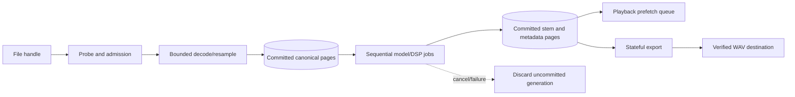

# Client-Side Backend Architecture

The client-side backend is all non-UI execution inside the browser: dedicated workers, OPFS/IndexedDB, ONNX Runtime Web, Web Audio/AudioWorklet, export rendering, and the service-worker-managed executable asset lifecycle. It has no remote API and receives no server compute merely because the page is served by the home server.

## Runtime topology

| Runtime | Owns | Communication | Forbidden work |
| --- | --- | --- | --- |
| Orchestrator worker | Job graph, reservations, checkpoints, cancellation, generation IDs | Typed commands/events; transferable buffers | DOM, unbounded concurrency |
| Decode/resample worker | Container probe, bounded decode, canonical 48 kHz chunks | Chunk descriptors and ownership transfer | Whole-file allocation without admission |
| Inference worker | One pinned ONNX Runtime Web session at a time, model-specific preprocessing/state | Committed input/output page references and progress | UI status invention, simultaneous unreserved models |
| DSP/analysis worker | OLA, masks, enhancement alignment, VAD intervals, peak pyramids | Canonical-frame metadata and PCM pages | Changing semantic labels without versioning |
| Storage worker | OPFS chunks, IndexedDB metadata/fallback, atomic manifests, cleanup | Versioned storage commands/results | Deleting committed user projects for cache space |
| Audio render thread | Bounded PCM consumption, smoothing, mixing, limiter | Lock-free/bounded queue and transport commands | File/network I/O, inference, blocking waits, hot-path allocation |
| Export worker | Stateful bounded render, metering, dither/WAV stream, verification | Immutable mix snapshot and sequential pages | Full-file Blob assembly without admission |
| Service worker | Versioned shell/runtime delivery and offline navigation | Cache requests and update messages | Project PCM, inference, project lifecycle |

Workers may be consolidated initially to reduce duplicated model/runtime memory, but their logical ownership stays distinct. Physical consolidation is measured and recorded; it must not blur cancellation or resource accounting.

## ONNX Runtime Web decision

ONNX Runtime Web is the primary inference runtime. HTDemucs and Silero use version-pinned ONNX artifacts. Provider selection is per model and environment:

1. Request and inspect a WebGPU adapter/device.
2. Create the exact model session and run a valid production-shape fixture.
3. Compare numerical output, peak memory, warm/sustained throughput, and device-loss recovery.
4. If any model-specific gate fails, dispose the session and retry from a checkpoint on qualified WASM SIMD/multithread or single-thread WASM.
5. If no provider passes, expose `unsupported`; never substitute a different model silently.

DeepFilterNet uses this runtime only if conversion parity passes. RNNoise may use a dedicated WASM module. See [[ADR 002 - Inference Backends]] and [[Model Runtime and Licensing]].

## Data lifecycle

Every stored artifact carries project, pipeline/model, rate, channel, start frame, valid frame count, format, and checksum/version metadata. Write content before atomically publishing the manifest entry. Restart trusts only committed entries.

## Capability states

Each subsystem reports `unknown`, `probing`, `available`, `degraded`, `unsupported`, or `recoverable-error`, with evidence metadata. “WebGPU available” and “HTDemucs WebGPU qualified” are separate capabilities. “OPFS API present” and “project paging throughput qualified” are separate. The frontend renders these states but does not infer them.

## Privacy boundary

Normal project processing performs no network request. Setup/update may fetch only version-pinned allowlisted executable/model assets. Audio, filenames, hashes derived from user audio, waveforms, probabilities, and project metadata remain local. A future CUDA service on the home server would send audio off the browser device and therefore requires a new product boundary, threat model, consent UX, and ADR.

See [[Boundary Contracts]], [[Memory and Storage]], [[Offline PWA Lifecycle]], and [[Test Environments]].
