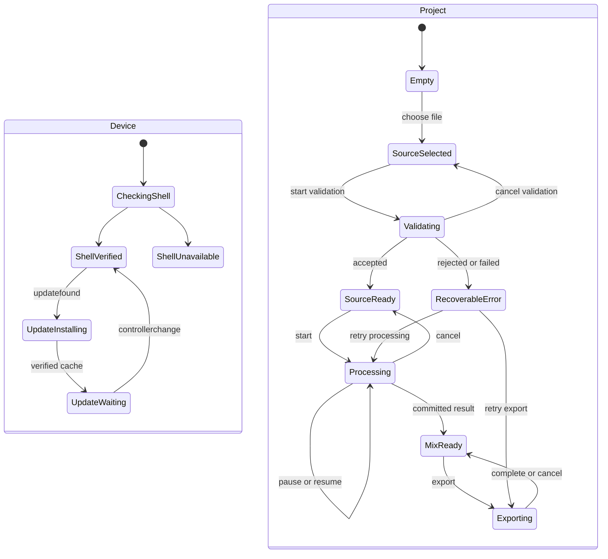

# Frontend Architecture

The frontend is the browser main-thread presentation and interaction layer. It renders honest capability and job state, accepts commands, and visualizes bounded metadata. It does not decode audio, run inference, retain full PCM, or use animation timing as the transport clock.

## Responsibilities

| Frontend owns | Frontend consumes | Frontend must not own |
| --- | --- | --- |
| Routes/views, focus, labels, responsive layout | Capability snapshots and setup readiness | Model sessions or provider fallback |
| User intent and draft control values | Job progress, recoverable errors, checkpoints | Full-track PCM or inference tensors |
| Import picker and consented local file handle handoff | Peak tiles and playhead snapshots | OPFS chunk writes or storage transactions |
| Mixer/transport commands | Authoritative transport state | Main-thread interval timers as audio clock |
| Export configuration and destination choice | Export progress and verification result | DSP/render loops or full export Blob assembly |
| Accessible status and recovery actions | Version/update and persistence status | Silent retry or fabricated capability states |

## Screens and states

Device readiness and project operation are separate state domains. Shell state separately records current cache verification, whether the current document is controlled, waiting-update progress, and current/waiting release IDs; `updatefound` and `controllerchange` refresh those facts. Model readiness remains separate. Project state tracks source selection/validation, processing or export jobs, the committed mix, error checkpoints, and transport. Processing pause/cancel belongs to the active job; playback buffering belongs to transport and does not change project phase.

Every asynchronous result carries an opaque UUID-based project ID, job ID, and safe-integer generation. The reducer ignores an event unless its identity matches the current running operation and the transition is legal. Cancel-pending jobs reject late success/failure results. Cancel completion advances the generation; validation returns to unvalidated `source-selected`, processing to `source-ready`, and export to the committed mix. See [[Flat Project State Alternative]] for the discarded design.

The foundation shell includes a user-invoked local diagnostic panel under setup. It renders the capability report as evidence with explicit Available, Unavailable, Unknown, and Error states. It explains that WebGPU adapter/device success does not qualify ONNX operators and does not export or transmit the report.

## Proposed module boundaries

| Module | Purpose | Depends on |
| --- | --- | --- |
| `src/app/` | App bootstrap, routing, dependency assembly | Contract clients only |
| `src/features/setup/` | Offline readiness, download/update/persistence UX | Setup capability service |
| `src/features/import/` | Pick file, show validation/admission result | Project command client |
| `src/features/transport/` | Play/pause/seek and authoritative playhead | Transport command/event client |
| `src/features/mixer/` | Four buses and macro controls | Mix state client |
| `src/features/waveform/` | Visible peak tiles and overlay playhead | Peak-tile/query client |
| `src/features/export/` | Export form, destination, verification result | Export command client |
| `src/ui/` | Reusable accessible controls and status primitives | No backend implementation |
| `src/contracts/` | Shared serializable types and schema/version IDs | Pure TypeScript only |

This is a planned layout, not a required framework choice. The foundation implements lifecycle rules in `src/lib/app-state.ts` and independent readiness in `src/lib/device-state.ts`. Component framework selection remains open until interaction complexity justifies it.

## Performance and accessibility

- Render waveform tiles only for the visible range; update the playhead overlay through `requestAnimationFrame` from authoritative audio time snapshots.
- Coalesce high-frequency meters/playhead events and do not announce them through live regions.
- Every async operation exposes stage, progress or indeterminate state, cancel availability, retry, and a stable error code translated into user language.
- Controls use native semantics, visible focus, keyboard operation, programmatic names/units, and reduced-motion behavior.
- Solo/mute/clip/connection states use text or icons in addition to color.
- Never say “offline ready,” “supported codec,” “four stems ready,” or “safe export” before the corresponding backend evidence state.

## Frontend tests

Pure state reducers and formatters receive unit tests. Browser tests cover keyboard/focus, responsive layout, offline/setup states, file rejection, progress/cancel/retry, stale event rejection, buffering, and export errors. Astra performs one final end-to-end UX acceptance only after all implementation phases and a clean Sol release-candidate review.

See [[Boundary Contracts]], [[User Experience and Recovery]], and [[Test Environments]]. Browser evidence is recorded in `implementation/evidence/i-002/README.md`.
