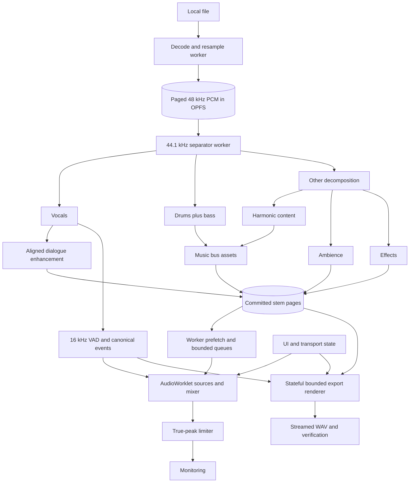

# System Architecture

TypeScript owns UI, application state, orchestration, and metadata. Native Web Audio nodes provide conventional real-time processing. Dedicated workers perform decode, resampling, model inference, peak analysis, and file I/O. A bounded AudioWorklet playback source consumes prepared PCM; it never performs file reads or inference on the render thread.

In this specification, **frontend** means the main-thread presentation and interaction layer described in [[Frontend Architecture]]. **Client-side backend** means the browser-resident workers, storage, inference, audio rendering, and export subsystems described in [[Client-Side Backend Architecture]]. It is not a remote server. Their typed interaction surface is [[Boundary Contracts]].

## Execution ownership

| Domain | Owns | Must avoid |
| --- | --- | --- |
| Main thread | State store, controls, transport commands, viewport and accessibility | Inference, full-file PCM copies, per-frame full waveform drawing |
| Workers | Codec processing, resampling, ML sessions, DSP analysis, OPFS access, export | Unbounded queues and simultaneous model residency without reservation |
| Audio render thread | Playback consumption, smoothing, mixer, limiter | Storage/network I/O, blocking waits, dynamic allocation in the hot path |
| Service worker | Versioned shell/runtime asset serving | Owning project audio or running inference |

Prefer one active inference model at a time. Persist stage results before releasing the session and starting the next stage. Provider fallback reconstructs a session at a checkpoint; it is not an uninterrupted swap.

## Contracts

- Transferable ArrayBuffers move ownership between threads; transfer does not make codec, GPU, or WASM boundaries automatically zero-copy.
- Audio packets carry project ID, generation ID, asset ID, canonical start frame, valid frame count, channel layout, and buffer ownership.
- Seek increments the generation ID; consumers discard stale packets and schedules.
- Jobs emit stage, completed/total work units, resource reservations, checkpoint, and recoverable error code.
- SharedArrayBuffer rings are an optional isolated deployment path. A bounded transferable-buffer pool is required where validated without shared memory.
- The project manifest references immutable committed chunks, pipeline/model versions, alignment offsets, VAD metadata, controls, and peak-pyramid levels.

One authoritative project clock and mix configuration feed preview and export. An OfflineAudioContext is a separate rendering graph, not a destination connected to the live graph. The chunked export mechanism remains gated because node state must survive boundaries; see [[Export and Metering]].

See [[Agent Orientation]], [[ADR 001 - Language and Runtime]], [[Memory and Storage]], [[Transport and Automation]], and [[Test Environments]].
