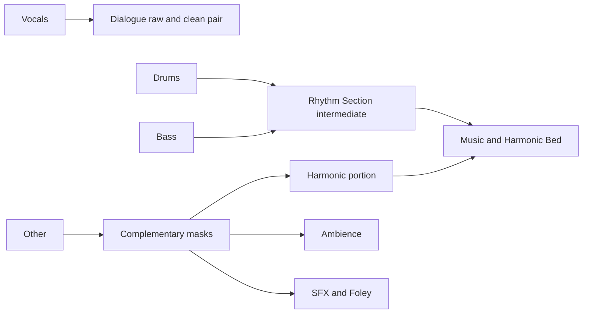

# Separation Pipeline

## Stage 1 — broad separation

Phase 0 candidate under D-007: a single four-stem `htdemucs` weight-only FP16 ONNX artifact. Resample canonical audio to the model's required 44.1 kHz stereo boundary and infer vocals, drums, bass, and other. This does not reduce the canonical 48 kHz Float32 project PCM. The exact artifact pin, ONNX conversion, and browser execution remain unproven until [[Model Runtime and Licensing]] gates pass.

The candidate window is 7.8 seconds, with 2.5 seconds overlap and a 5.3-second hop. At 44.1 kHz these are 343,980, 110,250, and 233,730 frames. The upstream project documents a maximum 7.8-second segment for Hybrid Transformer models; this is not a universal input shape or a proven optimal overlap for the chosen export. See [Demucs upstream](https://github.com/facebookresearch/demucs).

Use output-weighted overlap-add:

$$w[n]=0.5\left(1-\cos\frac{2\pi n}{N-1}\right),$$

$$y[n]=\frac{\sum_k w[n-kH]y_k[n-kH]}{\sum_k w[n-kH]}.$$

Accumulate weights explicitly; this hop is not assumed to satisfy constant-overlap-add. Pad the sequence and select its valid interior, or define one-sided endpoint windows, so every retained sample has positive accumulated weight. An epsilon denominator alone cannot recover samples multiplied by zero. Carry accumulation across storage pages, validate an identity runner first, then evaluate model boundary artifacts. Trim padding after resampling/alignment.

Process previews and full jobs sequentially within the resource budget. A preview uses the same model, provider, preprocessing, overlap, and output routing as the committed full pass. The scheduler may use the highest measured safe concurrency inside a chunk, but the commit order and bounded queue must remain deterministic. Release tensors after outputs are copied or transferred to committed working pages. Keep enough overlap context for deterministic restart. If provider or quality mode changes, invalidate affected preview evidence before resuming the full job.

## Stage 2 — heuristic decomposition of other

The supplied energy-ratio detector is retained as a feature, not a semantic classifier:

$$E_s[n]=\frac{1}{M}\sum_{k=0}^{M-1}x^2[n-k],\quad
E_l[n]=\frac{1}{L}\sum_{k=0}^{L-1}x^2[n-k],\quad
R[n]=\frac{E_s[n]}{E_l[n]+\epsilon}.$$

Proposed defaults: 5 ms short window, 100 ms long window, ratio threshold 2.2, and a 250 ms maximum short-transient duration. Define epsilon relative to the working signal scale and apply a silence floor. Compute linked stereo features so masking does not destabilize the stereo image.

Combine transient evidence with spectral flux and harmonicity to estimate three soft masks: harmonic music, ambience, and effects. Sustained low-flux content is ambiguous; never equate it categorically with ambience. The precise spectral analysis, classifier/mask design, and quality thresholds are [[Open Decisions]] and block calling this stage verified.

Require non-negative masks that sum to one per analysis element. If using an STFT, use common phase and a validated reconstruction window/hop. If using time masks, smooth transitions with a proposed 15 ms raised-cosine fade, then normalize masks again. Neither path may discard unclassified energy. Ambiguous content remains allocated by the partition with a low-confidence indication; it is not silently removed.

## Four-bus routing

Test reconstruction of the three masks back to other. Separately measure model reconstruction error against the input; complementary masks do not guarantee Demucs outputs sum exactly to the recording. Do not fix a model residual by silently injecting speech/noise into an unrelated bus. Audible model leakage and residual policy require the quality gate.

Stage 3 enhancement and Stage 4 VAD are specified in [[Dialogue Enhancement and VAD]]. Representative music, dialogue, sustained instruments, rain, applause, wind, traffic, and mixed effects belong in V-03 of [[Validation Plan]].
