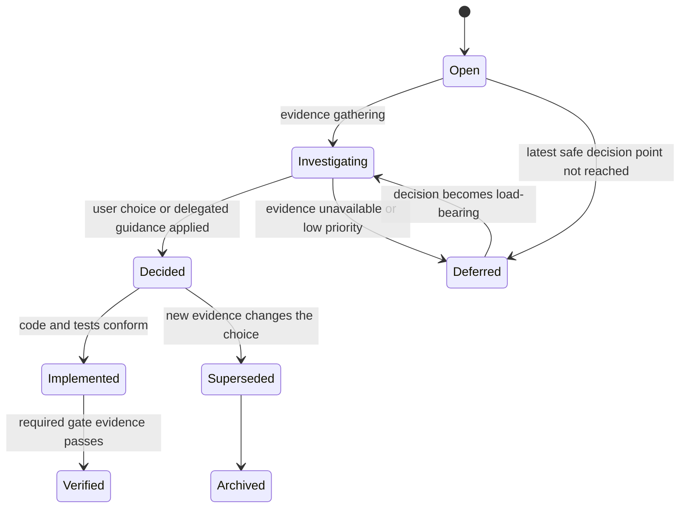

# Decision Lifecycle

The wiki is the source of truth. This process keeps active context small while preserving rejected research and rationale.

## States

`Decided` does not mean implemented. `Implemented` does not mean verified. Active notes must state the exact state accurately.

## One-decision thread protocol

The primary agent brings one decision at a time with:

1. the user/product outcome affected;
2. the point at which the choice becomes load-bearing;
3. verified facts and current unknowns;
4. two or three viable options, including operational consequences;
5. a recommendation and its single load-bearing reason;
6. what changes in requirements, ADRs, code, tests, and support claims;
7. a request for the user's choice or broad guidance.

After the user decides, update [[Decision Log]], the relevant ADR/active architecture notes, and [[Open Decisions]] before dependent implementation proceeds.

## Active decision record

The row in [[Decision Log]] stays concise:

| Field | Required content |
| --- | --- |
| ID and date | Stable decision ID and decision date |
| Decision | One sentence describing the selected path |
| Load-bearing reason | The decisive reason; if it becomes false, reopen the decision |
| Consequences | The important implementation/support obligations |
| State | Decided, implemented, verified, or superseded |
| Evidence | Links to gate results or implementation evidence |
| Archive | Link to rejected alternatives and detailed research |

Do not copy exploratory detail into active architecture notes. Those notes state the resulting contract.

## Archive rule

When an avenue is filtered out, move its detailed comparison, failed experiments, citations, and abandoned design to `wiki/Archive/Decisions/`. Give it frontmatter with `status: archived`, the decision ID, archive date, and `superseded_by` or `rejected_by`. Add it to [[Archive Index]] and link it from the active decision row.

An archive note is historical evidence. Agents must not implement from it unless the active decision is formally reopened. Archive files are retained, never silently rewritten to look like the current plan.

## Conflict rule

If code, tests, evidence, or an archived note conflicts with an active wiki note:

1. stop dependent implementation;
2. identify the conflict in the active thread;
3. decide whether code is wrong or the active decision must reopen;
4. update the active wiki first;
5. then reconcile code/tests and record evidence.

See [[Implementation Playbook]], [[Decision Log]], [[Open Decisions]], and [[Archive Index]].
