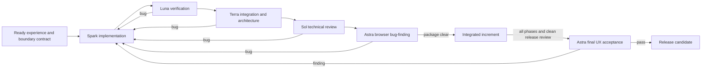

# Roadmap

The supplied four-phase, eight-week sequence is retained as an indicative plan. Delivery follows D-016/D-017 and [[Implementation Playbook]]: Spark is preferred for implementation; when unavailable, the primary integrator selects the lowest adequate non-Spark implementer. Independent Luna/Terra passes follow as applicable, Sol performs technical review whenever independent, and Astra finds bugs in the runnable browser experience. Findings return to the implementer and repeat the independent chain. Astra's final holistic UX acceptance remains a separate end-of-project gate. Dates are not commitments; task sizing and staffing have not been validated.

## Mandatory ordering

No work package advances on prose confidence. Its required artifacts, tests, and gate evidence must exist at each D-016 stage. Astra browser bug-finding occurs for user-visible packages; Astra UX acceptance remains reserved for the end and begins only after all implementation phases are complete, release-candidate checks pass, and Sol finds no unresolved critical/high technical issues.

## Experience contract — before dependent backend features

- [ ] Prototype the complete import → intention → preview → A/B/undo → quality plan → progress → review → export journey with local, clearly labeled fixtures.
- [ ] Test primary language and controls with people who understand desired sound but do not know browser/runtime architecture.
- [ ] Define what each macro control promises audibly, what uncertainty looks like, and how a user recovers when the preview is worse.
- [ ] Freeze typed UI/backend states only after the journey exposes the decisions the user actually needs.

This work does not fake inference. It establishes the experience contract that later vertical slices fulfill. Backend packages are selected and ordered by the next user-visible expectation they can reward, while privacy, correctness, and resource safety remain mandatory.

## Active implementation increment — I-001

**Goal:** create a runnable, offline-capable TypeScript PWA skeleton plus deterministic domain primitives that later audio and model work can depend on.

| Owner | Scope | Required output | Done when |
| --- | --- | --- | --- |
| Terra | Build/runtime foundation and application shell | Strict TypeScript project, PWA shell, accessible initial UI, worker-safe boundaries, build/test commands | Clean install/build/test succeeds and offline shell behavior has an automated or documented verification path |
| Luna | Pure audio-domain primitives | Canonical frame/rate conversion, bounded resource admission, immutable VAD interval derivation with unit tests | Boundary, rounding, invalid-input, and determinism tests pass without browser or model dependencies |
| Primary integrator | Resolve interfaces and run the combined checks | One coherent tree, implementation record, no duplicated contracts | Typecheck, tests, build, link validation, and review checklist pass |
| Sol | Independent technical review after integration | Severity-ranked findings with file/line evidence | All critical/high findings fixed or explicitly block the increment |
| Astra | Architecture review permitted for I-001; UX acceptance not scheduled | Severity-ranked architecture findings may guide remediation; final UX acceptance occurs after all phases and a clean Sol release review | Intermediate architecture review is distinct from the final UX gate |

**Excluded from I-001:** real model downloads/inference, semantic stem claims, production audio decoding, production OPFS streaming, true-peak certification, and release browser support. Placeholders must state these limits visibly and cannot return fake successful results.

## Phase 0 — feasibility and artifact selection

### Active production vertical slice — I-004

[[Implementation Package I-004 - Real Local Preview]] replaces the fixture source/monitoring path with real local audio/video playback through a bounded native Web Audio graph. It is deliberately honest about features that still require model artifacts, streaming render, and export qualification.

- [ ] Select and reproduce a pinned HTDemucs ONNX research artifact, preserve its separate scientific-purpose notice, and verify the exact download/distribution path.
- [ ] Run production-shape WebGPU/WASM probes, memory profiles, and sustained inference.
- [ ] Evaluate field-speech/music/ambience separation quality and Stage 2 mask design.
- [ ] Choose enhancement, decoder, resampler, limiter, and metering artifacts; audit redistribution.
- [ ] Prototype bounded large-file decode, OPFS paging, and final file save.
- [ ] Prove chunked export state continuity against a continuous reference.
- [ ] Resolve release-blocking items in [[Open Decisions]].

**Exit:** Initial evidence for V-01/V-02/V-03/V-06/V-09/V-11 justifies the chosen configuration. If no configuration passes, revise architecture/model/scope before promising the full product.

## Phase 1 — transport and storage (indicative weeks 1–2)

- [ ] Project/chunk manifests, atomic commits, resource reservations, recovery.
- [ ] OPFS worker streaming and bounded playback queue.
- [ ] Common timeline, play/seek/pause/buffering, generation cancellation.
- [ ] Four-bus routing, mid/side matrix, dual dialogue gains and safety stage.

**Exit:** V-02/V-05 pass for synthetic/reference stems, including long files and seek stress.

## Phase 2 — ML pipeline and ingestion (indicative weeks 3–4)

- [ ] Supported codec admission and canonical stateful resampling.
- [ ] Versioned model packages, valid-shape provider probing and checkpointed fallback.
- [ ] Demucs sliding-window inference, endpoint-safe overlap-add and output paging.
- [ ] Silero probabilities, exact timeline mapping, progress and cancellation.

**Exit:** V-01/V-03/V-04/V-09 pass for selected artifacts and supported configurations.

## Phase 3 — decomposition and enhancement (indicative weeks 5–6)

- [ ] Validated complementary harmonic/ambience/effects masks and four-bus routing.
- [ ] Stateful speech enhancement, latency compensation, smooth dry/wet control.
- [ ] Shared VAD threshold, clip generation, seek-safe ducking envelopes.
- [ ] Recovery and low-resource mode during sustained work.

**Exit:** V-03/V-04/V-05/V-10 pass; quality criteria justify user-facing stem labels.

## Phase 4 — export, persistence and polish (indicative weeks 7–8)

- [ ] Stateful bounded 24-bit WAV export, TPDF dither, loudness and true-peak verification.
- [ ] Versioned service-worker shell, cached runtime/model dependencies and readiness UI.
- [ ] Storage capacity/persistence handling and safe updates.
- [ ] Peak-pyramid canvas rendering, accessible controls and stage feedback.
- [ ] Cross-browser matrix, sustained-load profiling, offline/privacy and failure tests.

**Exit:** All applicable [[Validation Plan]] gates pass with reproducible evidence. Publish explicit device/browser/file limits and remaining quality limitations. “Verified implementation roadmap” is replaced with a gated plan because no implementation has yet been verified.
